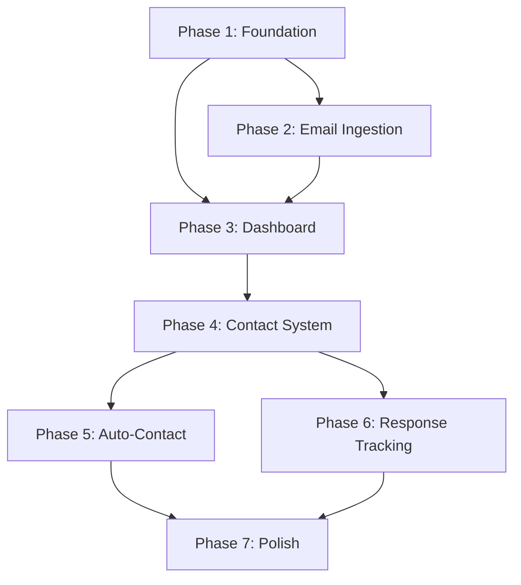

# StreetEasy Monitor: Implementation Plan

**Based on:** [PRODUCT-DESIGN.md](./PRODUCT-DESIGN.md)  
**Created:** 2026-02-07  
**Status:** Ready for Development

---

## Executive Summary

Transform StreetEasy Monitor from a single-user listing tracker into a multi-user platform with automated landlord/broker contact capabilities. Users forward StreetEasy alert emails → system extracts listings → auto-contacts on their behalf.

---

## Tech Stack Decisions

| Layer | Technology | Rationale |
|-------|------------|-----------|
| **Framework** | Next.js 14 (App Router) | SSR, API routes, React Server Components |
| **Language** | TypeScript | Type safety, better DX |
| **Database** | PostgreSQL + Prisma | Robust, JSONB for flexible data |
| **Auth** | Clerk | OAuth ready (Google, Apple), nice UI components |
| **Email Sending** | Resend | Developer-friendly, good deliverability |
| **Email Receiving** | SendGrid Inbound Parse / Mailgun Routes | Process forwarded StreetEasy emails |
| **Hosting** | Vercel | Next.js native, edge functions |
| **Email Parsing** | Custom + LLM | Extract listings from StreetEasy HTML emails |
| **Styling** | Tailwind CSS + shadcn/ui | Rapid UI development, good mobile support |
| **Animation** | Framer Motion | For swipe UX on mobile |

---

## Data Model

```prisma
model User {
  id                String   @id @default(cuid())
  email             String   @unique
  name              String?
  phone             String?
  replyToEmail      String?  // For broker responses
  moveInDate        String?  // "ASAP", "March 2026", etc.
  leaseTerm         Int?     // Months
  
  // Auto-contact settings
  autoContactMode   String   @default("review") // "off" | "review" | "auto"
  maxPrice          Int?
  onlyNoFee         Boolean  @default(false)
  skipStudios       Boolean  @default(false)
  dailyContactCount Int      @default(0)
  lastContactReset  DateTime @default(now())
  
  // Unique email forwarding address
  forwardingAddress String   @unique
  
  listings          Listing[]
  contacts          Contact[]
  templates         Template[]
  
  createdAt         DateTime @default(now())
  updatedAt         DateTime @updatedAt
}

model Listing {
  id              String   @id @default(cuid())
  userId          String
  user            User     @relation(fields: [userId], references: [id])
  
  // StreetEasy data
  streetEasyUrl   String
  address         String
  unit            String?
  neighborhood    String
  price           Int
  bedrooms        Int
  bathrooms       Float?
  noFee           Boolean  @default(false)
  brokerName      String?
  brokerEmail     String?
  brokerPhone     String?
  
  // Status
  status          String   @default("new") // "new" | "saved" | "contacted" | "skipped"
  contactedAt     DateTime?
  
  // Source email reference
  sourceEmailId   String?
  rawData         Json?    @db.JsonB
  
  contacts        Contact[]
  
  createdAt       DateTime @default(now())
  updatedAt       DateTime @updatedAt
  
  @@unique([userId, streetEasyUrl])
}

model Contact {
  id            String   @id @default(cuid())
  userId        String
  user          User     @relation(fields: [userId], references: [id])
  listingId     String
  listing       Listing  @relation(fields: [listingId], references: [id])
  
  // Email sent
  subject       String
  body          String   @db.Text
  sentAt        DateTime @default(now())
  
  // Response tracking
  responseStatus String  @default("pending") // "pending" | "responded" | "no_reply"
  responseAt     DateTime?
  responseThread Json?   @db.JsonB  // Store email thread
  
  createdAt     DateTime @default(now())
}

model Template {
  id          String   @id @default(cuid())
  userId      String
  user        User     @relation(fields: [userId], references: [id])
  
  name        String
  subject     String
  body        String   @db.Text
  isDefault   Boolean  @default(false)
  
  createdAt   DateTime @default(now())
  updatedAt   DateTime @updatedAt
}

model InboundEmail {
  id          String   @id @default(cuid())
  recipient   String   // forwarding address
  sender      String
  subject     String
  htmlBody    String?  @db.Text
  textBody    String?  @db.Text
  rawHeaders  Json?    @db.JsonB
  
  // Processing status
  processed   Boolean  @default(false)
  processedAt DateTime?
  listingsExtracted Int @default(0)
  
  createdAt   DateTime @default(now())
}
```

---

## Phased Breakdown

### Phase 1: Foundation (Week 1-2)
**Goal:** Project setup, authentication, basic user profile

| Task | Priority | Estimate |
|------|----------|----------|
| Initialize Next.js 14 project with TypeScript | P0 | 2h |
| Set up Prisma with PostgreSQL | P0 | 2h |
| Integrate Clerk authentication (Google, Apple, Email) | P0 | 4h |
| Create user profile page with contact info | P0 | 4h |
| Generate unique forwarding addresses per user | P0 | 2h |
| Landing page with sign-up CTA | P1 | 4h |
| Mobile-responsive layout with Tailwind | P1 | 4h |
| Deploy to Vercel | P0 | 2h |

**Deliverable:** Users can sign up, set profile, see their forwarding address

---

### Phase 2: Email Ingestion (Week 3-4)
**Goal:** Receive forwarded StreetEasy emails, extract listings

| Task | Priority | Estimate |
|------|----------|----------|
| Set up Mailgun/SendGrid inbound email webhook | P0 | 4h |
| Email routing: match recipient → user | P0 | 2h |
| StreetEasy email parser (extract listings from HTML) | P0 | 8h |
| LLM fallback for complex/changed email formats | P1 | 4h |
| Store raw emails + extracted listings | P0 | 2h |
| Onboarding wizard: email forwarding setup guide | P0 | 4h |
| Verification flow: detect first forwarded email | P1 | 4h |
| Cron job: retry failed email processing | P2 | 2h |

**Deliverable:** Forward email → listings appear in dashboard

---

### Phase 3: Dashboard & Listings (Week 5-6)
**Goal:** View, filter, save, skip listings

| Task | Priority | Estimate |
|------|----------|----------|
| Main dashboard layout (sidebar nav) | P0 | 4h |
| Listings feed with cards | P0 | 6h |
| Filter bar (neighborhood, price, bedrooms, fee) | P0 | 4h |
| Listing card states (new, viewed, contacted, saved) | P0 | 4h |
| Save/Skip actions | P0 | 2h |
| Empty states | P1 | 2h |
| Mobile swipe UX (Tinder-style) | P1 | 8h |
| Stats overview widget | P2 | 3h |

**Deliverable:** Fully functional listings browser

---

### Phase 4: Contact System (Week 7-8)
**Goal:** Contact listings via templated emails

| Task | Priority | Estimate |
|------|----------|----------|
| Template editor with variable support | P0 | 6h |
| Default template creation on signup | P0 | 1h |
| One-click contact modal with preview | P0 | 4h |
| Resend integration for sending emails | P0 | 4h |
| Contact history view | P0 | 4h |
| Daily contact limit (10/day) | P0 | 2h |
| Batch contact from queue | P1 | 4h |
| Track contact status (pending/responded) | P1 | 4h |

**Deliverable:** Users can contact listings with personalized emails

---

### Phase 5: Auto-Contact (Week 9-10)
**Goal:** Automatic contact based on rules

| Task | Priority | Estimate |
|------|----------|----------|
| Auto-contact settings UI | P0 | 4h |
| Contact queue (review mode) | P0 | 6h |
| Auto-send mode with filters | P0 | 6h |
| Queue processing cron job | P0 | 4h |
| Push notifications (new listing, contact sent) | P1 | 6h |
| Over-budget warnings in queue | P2 | 2h |

**Deliverable:** Hands-off apartment hunting

---

### Phase 6: Response Tracking (Week 11-12)
**Goal:** Track broker responses, conversation threads

| Task | Priority | Estimate |
|------|----------|----------|
| Reply-to routing (catch broker responses) | P0 | 6h |
| Conversation thread view | P0 | 6h |
| Response status badges | P0 | 2h |
| Notifications on response | P0 | 3h |
| Response rate analytics | P2 | 4h |

**Deliverable:** Full communication tracking

---

### Phase 7: Polish & Launch (Week 13-14)
**Goal:** Production-ready

| Task | Priority | Estimate |
|------|----------|----------|
| Error handling & edge cases | P0 | 8h |
| Rate limiting & abuse prevention | P0 | 4h |
| Email deliverability (SPF, DKIM, warm-up) | P0 | 4h |
| Privacy policy & terms | P0 | 2h |
| Analytics integration | P1 | 2h |
| Performance optimization | P1 | 4h |
| User feedback collection | P2 | 2h |

**Deliverable:** Ship it 🚀

---

## Task Summary by Priority

### P0 - Must Have (MVP)
- [x] Core infrastructure setup
- [ ] User auth with Clerk
- [ ] Email forwarding address generation
- [ ] Inbound email processing
- [ ] StreetEasy email parser
- [ ] Listings dashboard
- [ ] Contact templates
- [ ] One-click contact
- [ ] Auto-contact queue (review mode)

### P1 - Should Have
- [ ] Mobile swipe UX
- [ ] Batch operations
- [ ] Response tracking
- [ ] Push notifications
- [ ] Onboarding wizard

### P2 - Nice to Have
- [ ] Analytics dashboard
- [ ] Saved searches
- [ ] Response rate metrics
- [ ] Export data

---

## Dependencies



| Phase | Depends On |
|-------|------------|
| Email Ingestion | Foundation (user accounts for routing) |
| Dashboard | Foundation + Email Ingestion (listings to display) |
| Contact System | Dashboard (need listings to contact) |
| Auto-Contact | Contact System (need contact mechanism) |
| Response Tracking | Contact System (need sent emails to track) |
| Polish | All phases |

---

## External Dependencies

| Service | Required For | Account Needed |
|---------|--------------|----------------|
| Clerk | Authentication | Yes |
| Vercel | Hosting | Yes |
| PostgreSQL (Supabase/Neon) | Database | Yes |
| Mailgun OR SendGrid | Inbound email | Yes |
| Resend | Outbound email | Yes |
| Custom domain | Email forwarding | Yes |

---

## Risks & Mitigations

| Risk | Impact | Mitigation |
|------|--------|------------|
| StreetEasy changes email format | High | Use LLM as fallback parser, monitor for changes |
| Email deliverability issues | High | Proper SPF/DKIM, warm-up sending domain, daily limits |
| Broker spam complaints | High | Cap at 10/day, professional templates, honor unsubscribes |
| Clerk rate limits | Medium | Cache auth state, batch operations |
| Legal (CAN-SPAM) | Medium | Clear opt-out, legitimate business inquiry framing |

---

## Success Metrics

| Metric | Target | Notes |
|--------|--------|-------|
| Time from signup to first listing | < 5 min | Depends on email forwarding setup |
| Email parse success rate | > 95% | Track failures for debugging |
| Contact delivery rate | > 98% | Monitor bounces |
| User activation (sent ≥1 contact) | > 60% | Core product value |
| Response rate from listings | > 20% | Track for messaging optimization |

---

## Open Questions (for Sage 🧠)

1. **Pricing model** - Free tier limits? Pro tier features?
2. **Legal review** - CAN-SPAM compliance for automated outreach?
3. **Phone verification** - Required for auto-send mode?
4. **Multi-city expansion** - Other listing sites to support?

---

*Implementation plan by Friday 🔧 | Based on Dieter's design spec*
